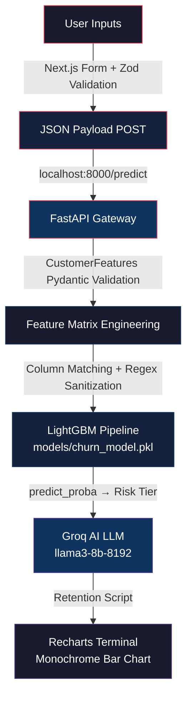

# Enterprise Churn Engine

Predictive retention infrastructure for telecommunications — LightGBM pipeline, FastAPI inference gateway, and multi-page brutalist frontend.

## System Architecture



## Dataset

**Source:** [`aai510-group1/telco-customer-churn`](https://huggingface.co/datasets/aai510-group1/telco-customer-churn) — 52-column extended Telco customer dataset with demographic, service, account, and churn attributes. Streaming ingest via Hugging Face `datasets` library with Polars zero-copy columnar processing.

| Metric | Value |
|--------|-------|
| ROC AUC | **0.9939** |
| Model | LightGBM — gradient boosted decision trees |
| Data Pipeline | Polars streaming |
| Training Volume | 50,000 customer records |
| Validation | Stratified 80/20 holdout |

## Repository Topology

```
.github/workflows/ci.yml      — Python lint + pytest + Next.js build verification
api/app.py                     — FastAPI: 39-field Pydantic model, CORS, Groq AI retention engine
config.yaml                    — Dataset source, model hyperparameters, drop-column list, MLflow config
docker-compose.yml             — Multi-container orchestration (api + frontend)
Dockerfile                     — Python 3.13-slim ASGI container
frontend/                      — Next.js 16: 3-page brutalist UI, Zustand stores, Zod schemas, Recharts viz
load_tests/locustfile.py       — Load generation: /health and /predict endpoint stress testing
models/churn_model.pkl         — Serialized LightGBM pipeline (generated by src/train.py)
requirements.txt               — Pinned deps: FastAPI, LightGBM, Groq, scikit-learn
src/data_preprocessing.py      — CSV or HuggingFace streaming with structural cleaning
src/feature_engineering.py     — Feature derivation: service counting, age binning, ratio calculations
src/predict.py                 — CLI inference: single record (JSON) and batch (CSV) prediction
src/train.py                   — Orchestrator: Polars ingest → feature engineering → LightGBM → MLflow
```

## Quick-Start

### Native

```bash
python -m venv venv && source venv/bin/activate   # Windows: venv\Scripts\activate
pip install -r requirements.txt
python src/train.py --config config.yaml

# Terminal 1 — Backend
uvicorn api.app:app --host 0.0.0.0 --port 8000

# Terminal 2 — Frontend
cd frontend && npm install && npm run dev
```

### Docker Compose

```bash
docker compose up --build
```

### API Test

```bash
curl -X POST http://localhost:8000/predict \
  -H "Content-Type: application/json" \
  -d '{
    "Gender": "Male",
    "SeniorCitizen": 0,
    "Partner": 0,
    "tenure": 2,
    "PhoneService": 1,
    "InternetService": 1,
    "Contract": "Month-to-Month",
    "PaperlessBilling": 1,
    "PaymentMethod": "Bank Withdrawal",
    "MonthlyCharges": 95.0,
    "TotalCharges": 190.0
  }'
```

## License

MIT — see [LICENSE](./LICENSE).
