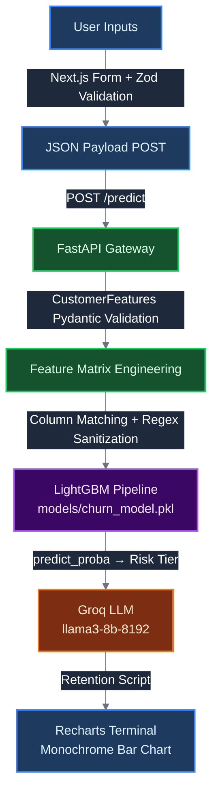

# Enterprise Churn Engine

Predictive retention system for telecoms. Uses LightGBM for churn risk scoring, FastAPI as the inference gateway, and a Next.js dashboard for interaction.

## Tech Stack

* **Frontend:** Next.js 16, TypeScript, Zustand, Zod, Recharts, Tailwind v4, Vitest
* **Backend:** FastAPI, Pydantic v2, Pandas, LightGBM
* **AI:** Groq LLM (llama3-8b-8192)
* **Data:** Hugging Face datasets, Polars streaming
* **Infra:** Docker Compose, Python 3.13

## System Architecture



## Dataset Configuration

Training data comes from [aai510-group1/telco-customer-churn](https://huggingface.co/datasets/aai510-group1/telco-customer-churn). It has 52 columns with demographics, services, account details, and churn labels. The pipeline removes 14 columns (IDs, location data, churn metadata) and builds features using one-hot encoding and column name sanitization.

* ROC AUC: **0.9939**
* Model: LightGBM (gradient boosted trees)
* Data Pipeline: Polars streaming
* Training Volume: 50,000 customer records
* Validation: Stratified 80/20 holdout

## Setup and Execution

### Configuration

Copy the example environment configuration to set API keys and endpoints:

```bash
cp .env.example .env
```

### Native Environment

```bash
python -m venv venv && source venv/bin/activate   # Windows: venv\Scripts\activate
pip install -r requirements.txt
pip install -r requirements-dev.txt

# Run the training pipeline (requires HF_TOKEN if gated dataset)
python src/train.py

# Terminal 1 - Backend
uvicorn api.app:app --host 0.0.0.0 --port 8000

# Terminal 2 - Frontend
cd frontend && npm install && npm run dev
```

### Docker Compose

```bash
docker compose up --build
```

### API Inference Test

```bash
curl -X POST http://localhost:8000/predict \
  -H "Content-Type: application/json" \
  -d '{
    "Gender": "Male",
    "SeniorCitizen": 0,
    "Partner": 0,
    "tenure": 2,
    "PhoneService": 1,
    "InternetService": 1,
    "Contract": "Month-to-Month",
    "PaperlessBilling": 1,
    "PaymentMethod": "Bank Withdrawal",
    "MonthlyCharges": 95.0,
    "TotalCharges": 190.0
  }'
```

## Project Structure

```text
.
├── .github
│   ├── dependabot.yml
│   └── workflows
│       └── ci.yml
├── api
│   ├── __init__.py
│   └── app.py
├── frontend
│   ├── src
│   │   ├── app
│   │   │   ├── analysis/page.tsx
│   │   │   ├── parameters/page.tsx
│   │   │   ├── status/page.tsx
│   │   │   ├── favicon.ico
│   │   │   ├── globals.css
│   │   │   ├── layout.tsx
│   │   │   └── page.tsx
│   │   ├── components/ui/FormField.tsx
│   │   ├── lib/schema.ts
│   │   ├── store/useChurnStore.ts
│   │   ├── tests
│   │   │   ├── components.test.tsx
│   │   │   └── store.test.ts
│   │   └── types/api.ts
│   ├── .dockerignore
│   ├── .gitignore
│   ├── Dockerfile
│   ├── eslint.config.mjs
│   ├── next.config.ts
│   ├── package-lock.json
│   ├── package.json
│   ├── postcss.config.mjs
│   ├── tsconfig.json
│   └── vitest.config.ts
├── load_tests
│   └── locustfile.py
├── models
│   └── churn_model.pkl
├── scripts
│   └── monitor_health.py
├── src
│   ├── __init__.py
│   ├── config.py
│   ├── data_preprocessing.py
│   ├── feature_engineering.py
│   ├── predict.py
│   └── train.py
├── tests
│   ├── integration/test_full_stack.py
│   ├── __init__.py
│   ├── test_api.py
│   └── test_src.py
├── .dockerignore
├── .env.example
├── .flake8
├── .gitignore
├── docker-compose.yml
├── Dockerfile
├── LICENSE
├── Makefile
├── README.md
├── requirements-dev.txt
└── requirements.txt
```

## Load Test Results

Benchmark: Locust with 10 concurrent users, spawn rate 2/s, 30s duration.

* Requests Per Second: 6.72
* Failure Rate: 0.00%
* Average Latency: 187 ms
* p50 (Median): 53 ms
* p95: 2000 ms
* p99: 3700 ms
* Total Requests: 196
* Total Failures: 0

## Testing & CI

```bash
# All backend tests
python -m pytest tests/ -v

# With coverage
python -m pytest tests/ --cov=api --cov=src --cov-report=term-missing

# Frontend tests
cd frontend && npm test

# Load testing
locust -f load_tests/locustfile.py --headless -u 10 -r 2
```

The test suite mocks the Groq API. The CI pipeline enforces a minimum 80% code coverage threshold.

## License

MIT. See [LICENSE](./LICENSE).
